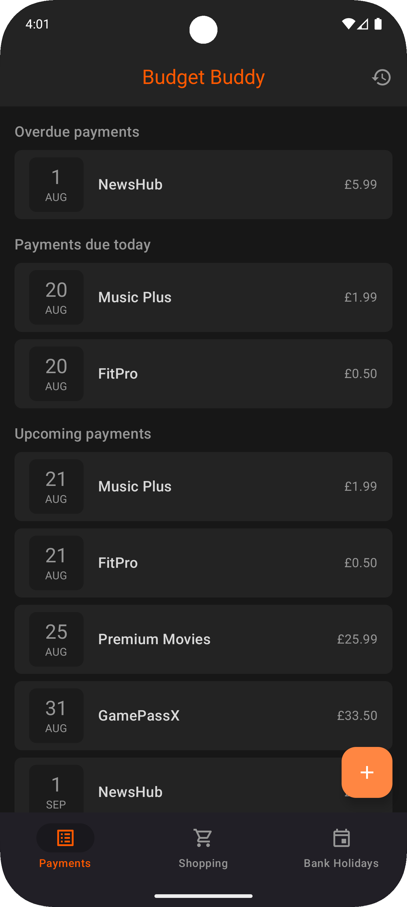
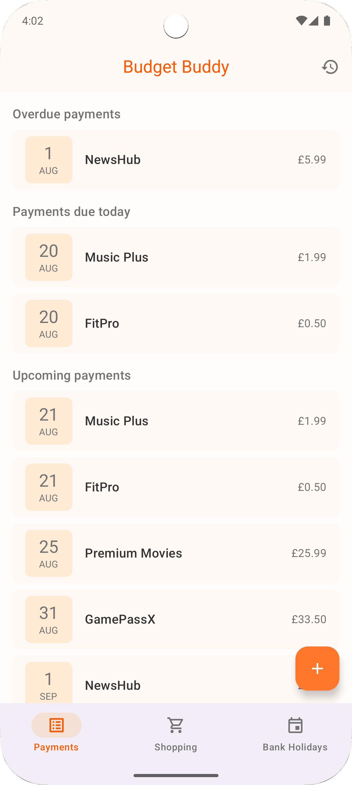
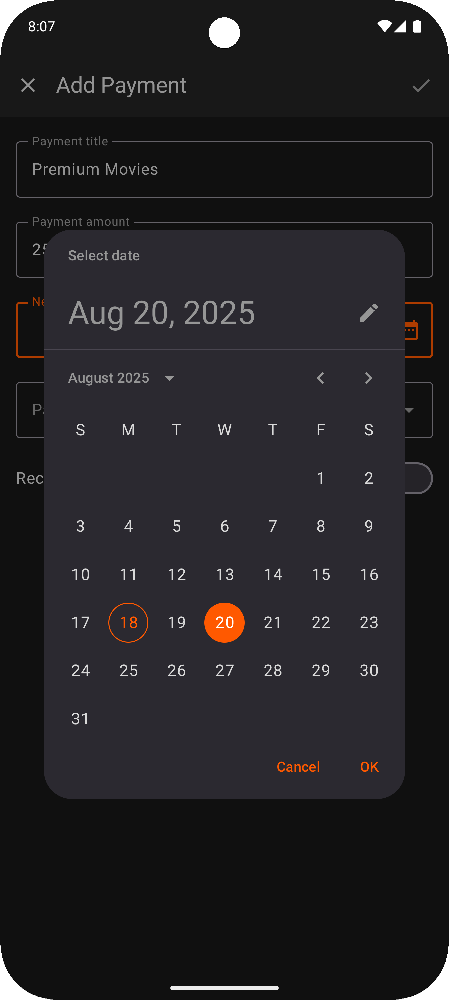
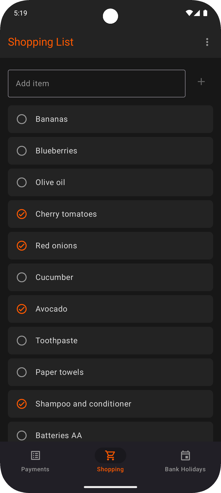
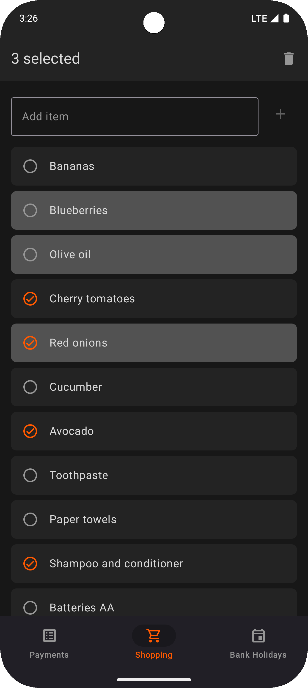
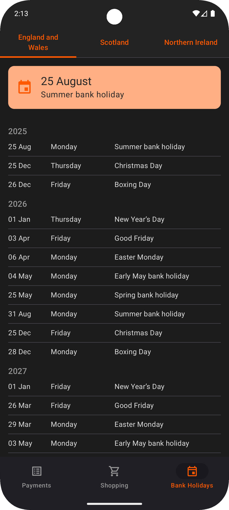

# BudgetBuddy

BudgetBuddy is an Android app that helps users track recurring payments, manage shopping lists, and view UK bank holidays.  
Built with Kotlin and Jetpack Compose.

## Features

* Manage recurring and one-time payments with optional reminders
* View, manage, and delete payments; browse Payment History
* Manage a shopping list
* View upcoming UK bank holidays
* Automatically schedule recurring payments
* Navigate quickly via deep links and app shortcuts

## Screenshots

| Payment List (dark mode)                                   | Payment List (light mode)                                    | Add Payment                                 |
|------------------------------------------------------------|--------------------------------------------------------------|---------------------------------------------|
|  |  |  |

| Shopping List                                   | Shopping List (multi-select)                                         | Bank Holidays                                   |
|-------------------------------------------------|----------------------------------------------------------------------|-------------------------------------------------|
|  |  |  |

## Tech Stack

* Kotlin, Jetpack Compose
* Clean Architecture, MVVM
* Hilt
* Navigation Compose
* Room
* Retrofit & Gson
* Coroutines & Flow
* WorkManager (recurring payments & notifications)
* Testing: JUnit, Mockito, Hilt Testing, Compose UI Tests

## Architecture

Clean Architecture for clear separation of concerns and easy testing.

```
presentation  -->  domain  <--  data
(UI/ViewModel)    (use cases)   (db/network/workers)
```

**Data flow:** `UI → ViewModel → Use case → Repository → Flow<Result<…>> → ViewModel → UI`

### Structure

This repo uses a feature-first package layout. Each feature keeps its Compose UI, ViewModel, and the concrete data access it needs (repositories, DAOs or API clients).

* `payment/` — screens, ViewModel, use cases; `PaymentRepository`, `PaymentDao`; schedulers/workers for recurring payments & notifications
* `shopping/` — screens, ViewModel; `ShoppingRepository`, `ShoppingDao`
* `bankholiday/` — screens, ViewModel; Retrofit `ApiService`, mapper, `BankHolidayRetriever`
* `ui/theme/` — theming and small UI utilities (e.g., `BudgetBuddyTheme`, `StatusBarBackground`)
* **Root:** App entry & navigation (`MainActivity`, `MainScreen`, `AppNavGraph`/`BottomNav`) · Shared UI (`ErrorScreen`, `LoadingScreen`, `SectionHeader`) · App setup (`BudgetBuddyApplication`, `Room DB` & `RoomTypeConverter`) · `Result`
* **Hilt modules** (e.g., `NetworkModule`, `BankHolidayRetrieverModule`) live next to the feature they wire up

### Dependency Rules

* Inward only: `presentation → domain`, `data → domain`
* `domain` stays Android-free (no Retrofit/Room/Hilt/Compose imports)
* Repository contracts live in `domain`; implementations live next to features and are bound via Hilt

## Key Design Decisions

* MVVM in presentation; one ViewModel per screen; state exposed as `StateFlow<UiState>`
* Single-purpose use cases (one intent per operation)
* WorkManager schedules the next payment and reminder notifications
* Deep links & app shortcuts to Shopping List and Bank Holidays
* Edge-to-edge system bars with automatic icon contrast
* Material 3 components and theming

## Architecture Layers

* **Domain** — pure Kotlin use cases; no Android/IO; depends only on interfaces
* **Data** — repository & background-work implementations; adapts Room/Retrofit/WorkManager; mapping & streams
* **Presentation** — Compose UI & ViewModels; navigation (deep links, app shortcuts); no direct DB/network

## Models

The app currently reuses Room entities because they match UI needs. If the project grows in complexity, separate domain models and mappers will be introduced to keep clear boundaries.

## Tests

* Unit tests for ViewModels and Use Cases
* Integration tests for Repositories and DAOs
* Compose UI tests for screens and components
